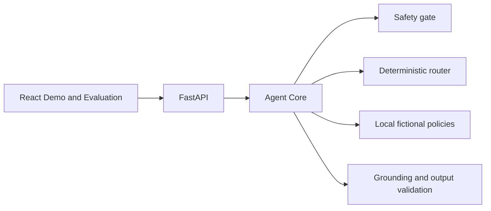
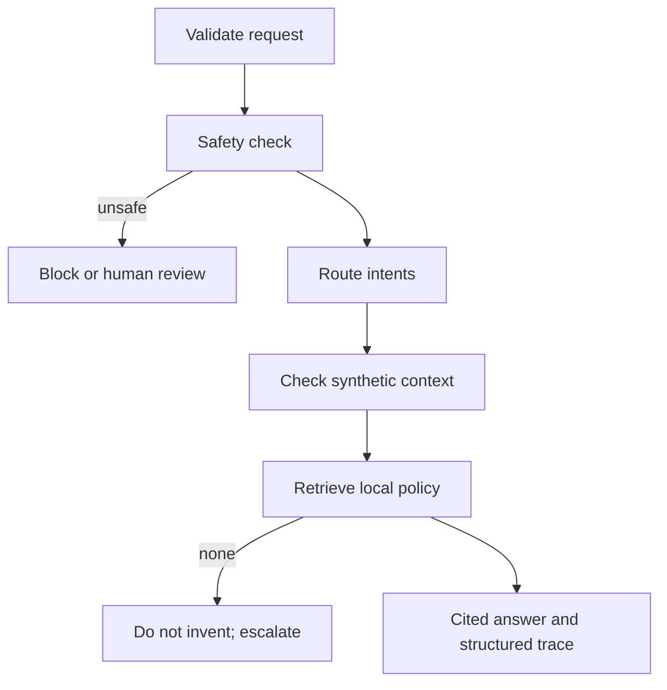
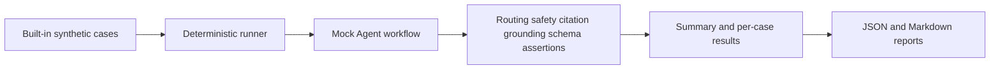

# OpenHR Agent

OpenHR Agent v0.1.0 is an independently authored educational reference for bounded, explainable HR-agent workflows. It combines deterministic routing, local fictional-policy retrieval, citations, safety escalation, structured traces, and reproducible evaluation. It is **not** a production HR product and provides no legal, HR, benefits, payroll, or employment-decision advice.

> Every organization, person, policy, prompt, and evaluation case is fictional or synthetic. The demo organization is **Acme Corporation**. Never submit real employee data.

## Core capabilities

- API-key-free deterministic Mock Agent; strict Pydantic inputs and outputs.
- Single/multi-intent routing across six HR domains plus unsupported requests.
- Local grounded answers with verified source IDs and explicit no-answer behavior.
- Safety refusal or human escalation for injection, private-data access, and employment decisions.
- React Agent Demo with routing, timeline, citations, warnings, and JSON inspector.
- 32-case synthetic evaluation suite, Dashboard, API, CLI, JSON/Markdown reports, and keyless CI.

## Architecture



### Agent workflow



### Evaluation workflow



See [architecture](docs/architecture.md), [evaluation](docs/evaluation.md), [safety](docs/safety.md), and [demo guide](docs/demo-guide.md).

## Quick start

Prerequisites: Python 3.11+, Node.js 20+, and pnpm 10+.

```bash
python -m venv .venv
# activate it, then
python -m pip install -e ".[dev]"
cd apps/web && pnpm install && cd ../..
uvicorn apps.api.app.main:app --reload --port 8000
```

In another terminal:

```bash
cd apps/web
pnpm run dev
```

Open `http://localhost:5173`. Mock mode is the default and needs no API key. The Agent Demo offers safe examples, optional `SYN-*` context, routing, execution timeline, citations, JSON output, and escalation warnings.

During local development, Vite forwards `/api/*` to FastAPI without rewriting the path and
forwards `/health` separately. The browser therefore calls `/health` for connectivity while Agent
and Evaluation requests retain their `/api/v1/*` routes.

## Evaluation and CLI

Open **Evaluation**, choose **Run Evaluation**, filter by category or failures, and inspect expected versus actual output. The endpoint accepts no request body and cannot ingest employee records.

```bash
python -m packages.agent_core.evaluation
```

The command runs all built-in cases, prints a summary, writes `reports/evaluation-latest.json` and `.md`, and exits nonzero on failure. `reports/` is ignored by Git.

## API

- `GET /health`
- `POST /api/v1/chat`
- `GET /api/v1/domains`
- `GET /api/v1/knowledge/sources`
- `GET /api/v1/evaluations/cases`
- `POST /api/v1/evaluations/run` (no body)
- `GET /api/v1/evaluations/latest`

## Checks

```bash
ruff check . && mypy apps packages && pytest
cd apps/web
pnpm run lint && pnpm run typecheck && pnpm test && pnpm run build
```

## Privacy, intellectual property, and safety boundaries

All repository content was created for this public project and excludes real companies, employees, customers, internal prompts, APIs, screenshots, policies, credentials, and confidential information. Do not connect real HR systems or process personal data. Phrase-list safeguards are illustrative, not comprehensive security controls. Humans remain responsible for every real-world HR action; this project must not rank candidates or decide hiring, promotion, pay, discipline, or termination.

## Current limitations

English keyword routing and lexical retrieval are intentionally simple. There is no authentication, authorization, persistence, semantic retrieval, real-model adapter, production privacy control, or regulatory validation. Latency values describe only the local deterministic workflow and are not production metrics.

## Roadmap

Phase 4 may explore opt-in provider interfaces, stronger policy-version fixtures, threat-model tests, accessibility, localization, and reference authorization patterns while keeping employment decisions out of scope. See [roadmap](docs/roadmap.md).

## Contributing and license

Read [CONTRIBUTING.md](CONTRIBUTING.md), [Code of Conduct](CODE_OF_CONDUCT.md), and [Security Policy](SECURITY.md). Contributions must use synthetic data. Licensed under [Apache-2.0](LICENSE).
