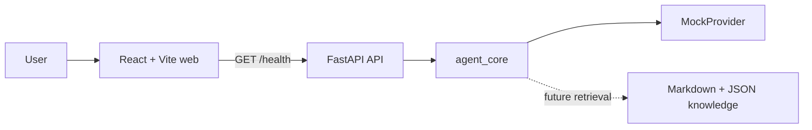

# OpenHR Agent

OpenHR Agent is an independently built, open-source reference framework for safe, modular, and evaluable HR AI agents. Phase 1 provides a runnable foundation only—not a production HR product.

> All organizations, people, policies, and questions in this repository are fictional or synthetic. The example organization is **Acme Corporation**.

## Goals

- Demonstrate a clean web/API/agent-core architecture.
- Run without API keys through a deterministic `MockProvider`.
- Make safety, privacy, modularity, and evaluation first-class concerns.

## Non-goals

- Production HR case management, employee profiling, or automated employment decisions.
- Legal, HR, payroll, benefits, or employment advice.
- Integration with real employee systems or proprietary company workflows.

## Architecture



- `apps/web`: React, TypeScript, Vite, Vitest
- `apps/api`: FastAPI application
- `packages/agent_core`: provider abstractions and default mock implementation
- `knowledge/fictional_company`: fictional Acme Corporation policies
- `examples`: synthetic example records and questions

See [architecture](docs/architecture.md), [privacy](docs/data-privacy.md), and [roadmap](docs/roadmap.md).

## Local setup

Prerequisites: Node.js 20+, pnpm 10+, and Python 3.11+.

```bash
cp .env.example .env
cd apps/web && pnpm install
cd ../api && python -m venv .venv
# activate the virtual environment, then:
python -m pip install -e "../..[dev]"
```

No API key is required. Start the API from the repository root:

```bash
cd ../..
uvicorn apps.api.app.main:app --reload --port 8000
```

Start the web app in another terminal:

```bash
cd apps/web
pnpm run dev
```

Open `http://localhost:5173`. The development server proxies `/api` to the API.

## Test and build

```bash
cd apps/web
pnpm run typecheck
pnpm test
pnpm run build

# from repository root
pytest
ruff check .
mypy apps packages
```

## Data, privacy, and intellectual property

All sample content was created for this public project from scratch. It contains no employer, client, or internal prompts, workflows, policies, employee data, endpoints, screenshots, secrets, or proprietary code. Never add real personal data or confidential material. See [data privacy](docs/data-privacy.md) and [security policy](SECURITY.md).

## Current limitations

The API exposes only health status; the UI demonstrates connectivity; the provider is a deterministic mock. Retrieval, authentication, authorization, persistence, evaluation suites, and real model adapters are intentionally not implemented.

## Roadmap

1. Foundation (current): runnable web/API skeleton and mock provider.
2. Safe retrieval over fictional knowledge with citations.
3. Evaluation fixtures, guardrails, and observability.
4. Optional model adapters and reference deployment guidance.

## Contributing

Read [CONTRIBUTING.md](CONTRIBUTING.md) and the [Code of Conduct](CODE_OF_CONDUCT.md). Please use synthetic data only.

## Disclaimer

OpenHR Agent is an educational reference framework. It does **not** provide legal, human-resources, benefits, payroll, or employment-decision advice. Human review and qualified professional guidance are required for real-world use.

## License

Licensed under the [Apache License 2.0](LICENSE).
