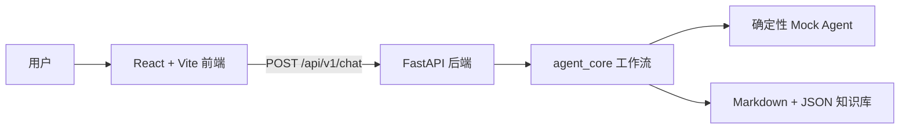

# OpenHR Agent

OpenHR Agent v0.1.0 是一个从零独立开发的开源教育参考框架，用于探索如何构建安全、模块化、可评测的 HR AI Agent。第三阶段加入 32 条合成案例、确定性评测 Runner、API、CLI、报告和 Evaluation Dashboard，但仍不是生产级人力资源产品。

> 仓库中的组织、人物、政策和问题均为虚构或合成内容，示例公司统一为 **Acme Corporation**。

## 项目目标

- 展示清晰的前端、API 与 Agent Core 分层架构。
- 默认使用确定性的 `MockProvider`，无需 API Key。
- 将安全、隐私、模块化和评测作为核心设计原则。

## 非目标

- 不构建生产级 HR 工单、员工画像或自动雇佣决策系统。
- 不提供法律、人事、薪酬、福利或雇佣建议。
- 不连接真实员工系统，不复刻任何公司内部流程。

## 技术架构



- `apps/web`：React、TypeScript、Vite、Vitest
- `apps/api`：FastAPI 应用
- `packages/agent_core`：模型 Provider 抽象与默认 Mock 实现
- `knowledge/fictional_company`：Acme Corporation 虚构政策
- `examples`：合成员工与示例问题

详细设计见[架构](docs/architecture.md)、[路由](docs/routing.md)、[安全](docs/safety.md)、[检索](docs/retrieval.md)、[数据隐私](docs/data-privacy.md)和[路线图](docs/roadmap.md)。

## 本地安装与启动

需要 Node.js 20+、pnpm 10+、Python 3.11+。

```bash
cp .env.example .env
cd apps/web && pnpm install
cd ../api && python -m venv .venv
# 激活虚拟环境后执行
python -m pip install -e "../..[dev]"
```

从仓库根目录启动后端（无需 API Key）：

```bash
cd ../..
uvicorn apps.api.app.main:app --reload --port 8000
```

另开终端启动前端：

```bash
cd apps/web
pnpm run dev
```

访问 `http://localhost:5173`。开发服务器会把 `/api/*` 原样代理到后端，并单独代理
`/health`；健康检查使用 `/health`，Agent 和 Evaluation 请求保持 `/api/v1/*` 路径。

## 测试与构建

```bash
cd apps/web
pnpm run typecheck
pnpm test
pnpm run build

# 仓库根目录
pytest
ruff check .
mypy apps packages
```

## 合成数据、隐私与知识产权声明

所有示例均为本开源项目从零创作的虚构或合成内容，不包含任何雇主、客户或内部 Prompt、工作流、制度、员工数据、接口、截图、密钥或专有代码。请勿贡献真实个人信息或保密材料。详见[数据隐私文档](docs/data-privacy.md)与[安全政策](SECURITY.md)。

## Agent API

- `POST /api/v1/chat`：执行确定性工作流并返回 `AgentResponse`。
- `GET /api/v1/domains`：列出路由领域。
- `GET /api/v1/knowledge/sources`：列出虚构本地来源。
- `GET /health`：服务健康检查。
- `GET /api/v1/evaluations/cases`：读取内置合成评测案例。
- `POST /api/v1/evaluations/run`：运行完整评测；不接收请求体或员工数据。
- `GET /api/v1/evaluations/latest`：读取本进程最近一次评测。

工作流执行输入验证、简单注入拦截、单/多意图路由、本地政策检索、带引用回答以及高风险或无依据请求升级。它不会调用真实模型。

## Evaluation 与 CLI

前端 **Evaluation** 页面可以运行全套确定性 Mock Agent 评测、查看汇总指标、按分类或失败案例筛选，并比较预期和实际 JSON。评测不调用真实模型、外部 API，也不需要密钥。

```bash
python -m packages.agent_core.evaluation
```

命令将 JSON 和 Markdown 报告写入已被 Git 忽略的 `reports/`，任一案例失败时返回非零退出码。详见[评测说明](docs/evaluation.md)、[演示指南](docs/demo-guide.md)和[发布检查表](docs/release-checklist.md)。

## 当前限制

路由和安全检查依赖有限的英文词组，检索为词法匹配而非语义搜索。尚无认证、授权、持久化、生产级隐私控制、监管验证或真实模型适配器。评测延迟仅为本地 Mock 工作流数据，不代表生产指标。不得处理真实个人数据。

## Roadmap

1. 基础架构：可运行的前后端骨架与 Mock Provider。
2. 核心工作流：路由、安全本地检索、引用和人工升级。
3. v0.1.0（当前）：确定性评测、Dashboard、CLI、报告与发布文档。
4. 可选 Provider 接口、更强对抗测试、无障碍与本地化参考。

## 贡献方式

请阅读 [CONTRIBUTING.md](CONTRIBUTING.md) 与 [CODE_OF_CONDUCT.md](CODE_OF_CONDUCT.md)，并仅使用合成数据。

## 免责声明

OpenHR Agent 仅为教育和技术参考框架，**不提供法律、人事、福利、薪酬或雇佣决策建议**。任何真实场景均需要人工审核及合格专业人士意见。

## License

项目采用 [Apache License 2.0](LICENSE)。
