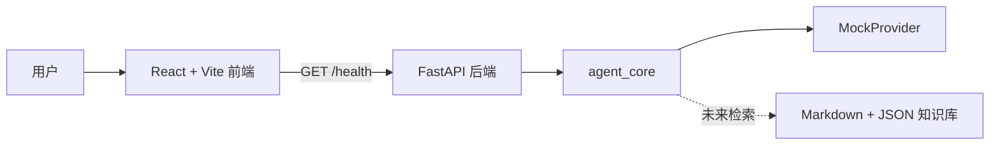

# OpenHR Agent

OpenHR Agent 是一个从零独立开发的开源参考框架，用于探索如何构建安全、模块化、可评测的 HR AI Agent。第一阶段仅提供可运行的项目基础架构，不是完整或可直接用于生产的人力资源产品。

> 仓库中的组织、人物、政策和问题均为虚构或合成内容，示例公司统一为 **Acme Corporation**。

## 项目目标

- 展示清晰的前端、API 与 Agent Core 分层架构。
- 默认使用确定性的 `MockProvider`，无需 API Key。
- 将安全、隐私、模块化和评测作为核心设计原则。

## 非目标

- 不构建生产级 HR 工单、员工画像或自动雇佣决策系统。
- 不提供法律、人事、薪酬、福利或雇佣建议。
- 不连接真实员工系统，不复刻任何公司内部流程。

## 技术架构



- `apps/web`：React、TypeScript、Vite、Vitest
- `apps/api`：FastAPI 应用
- `packages/agent_core`：模型 Provider 抽象与默认 Mock 实现
- `knowledge/fictional_company`：Acme Corporation 虚构政策
- `examples`：合成员工与示例问题

详细设计见 [架构文档](docs/architecture.md)、[数据隐私](docs/data-privacy.md) 和 [路线图](docs/roadmap.md)。

## 本地安装与启动

需要 Node.js 20+、pnpm 10+、Python 3.11+。

```bash
cp .env.example .env
cd apps/web && pnpm install
cd ../api && python -m venv .venv
# 激活虚拟环境后执行
python -m pip install -e "../..[dev]"
```

从仓库根目录启动后端（无需 API Key）：

```bash
cd ../..
uvicorn apps.api.app.main:app --reload --port 8000
```

另开终端启动前端：

```bash
cd apps/web
pnpm run dev
```

访问 `http://localhost:5173`，开发服务器会把 `/api` 代理到后端。

## 测试与构建

```bash
cd apps/web
pnpm run typecheck
pnpm test
pnpm run build

# 仓库根目录
pytest
ruff check .
mypy apps packages
```

## 合成数据、隐私与知识产权声明

所有示例均为本开源项目从零创作的虚构或合成内容，不包含任何雇主、客户或内部 Prompt、工作流、制度、员工数据、接口、截图、密钥或专有代码。请勿贡献真实个人信息或保密材料。详见[数据隐私文档](docs/data-privacy.md)与[安全政策](SECURITY.md)。

## 当前限制

后端目前仅提供健康检查；前端仅演示连接状态；Provider 为确定性 Mock。检索、认证、授权、持久化、完整评测和真实模型适配器均尚未实现。

## Roadmap

1. 基础架构（当前）：可运行的前后端骨架与 Mock Provider。
2. 基于虚构知识库、带引用的安全检索。
3. 评测数据、护栏与可观测性。
4. 可选模型适配器与参考部署方案。

## 贡献方式

请阅读 [CONTRIBUTING.md](CONTRIBUTING.md) 与 [CODE_OF_CONDUCT.md](CODE_OF_CONDUCT.md)，并仅使用合成数据。

## 免责声明

OpenHR Agent 仅为教育和技术参考框架，**不提供法律、人事、福利、薪酬或雇佣决策建议**。任何真实场景均需要人工审核及合格专业人士意见。

## License

项目采用 [Apache License 2.0](LICENSE)。
