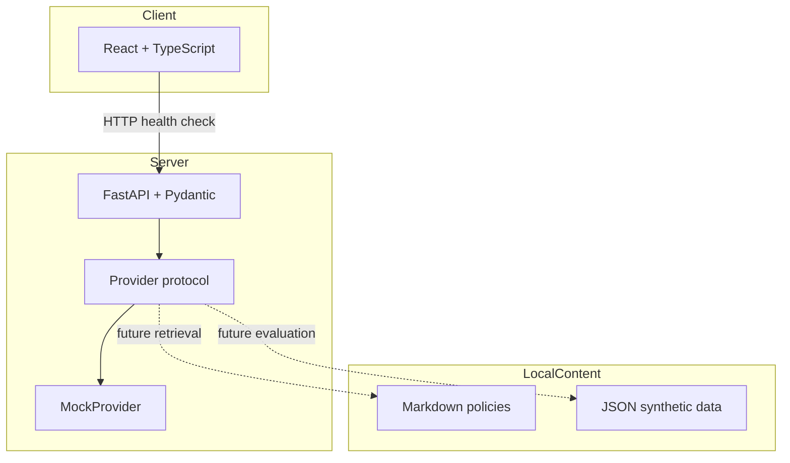

# Architecture

OpenHR Agent uses a small monorepo with independently testable layers.

## Boundaries

The web application owns presentation and API connectivity. FastAPI owns transport and validation. `agent_core` owns model-neutral contracts. Knowledge is plain, reviewable local content. The default mock is deterministic and performs no network requests.

Phase 1 deliberately excludes chat endpoints, retrieval, persistence, authentication, real providers, and employment decisions.
