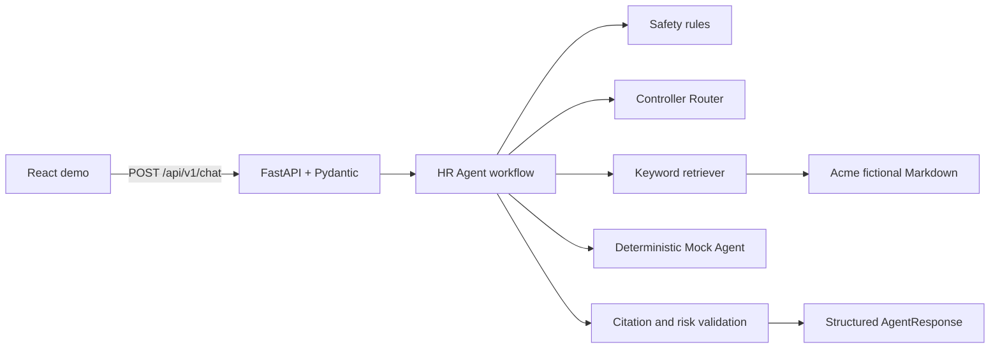
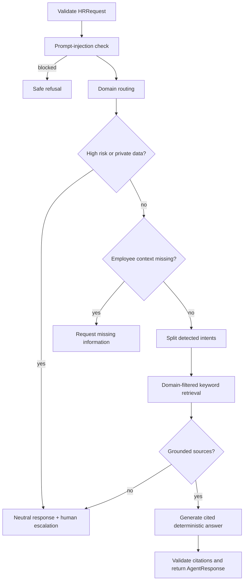

# Architecture

OpenHR Agent is a small monorepo with independently testable web, API, and deterministic Agent Core layers.

## Request lifecycle

The web application owns presentation. FastAPI owns transport and validation. `agent_core` owns strict models, routing, safety, retrieval, and workflow orchestration. Markdown policies are local and reviewable. No model or external network call occurs in the default path.

See [routing](routing.md), [safety](safety.md), and [retrieval](retrieval.md).
